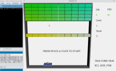

# Block Breaker

Block(brick) breaker for Assignment in Programming Methodology class.

Time, Collision engine is implemented.

Use OpenGL for 3D Graphic.

There are items like fog, sticker, fire, multi-ball, big bar, small bar, etc..

